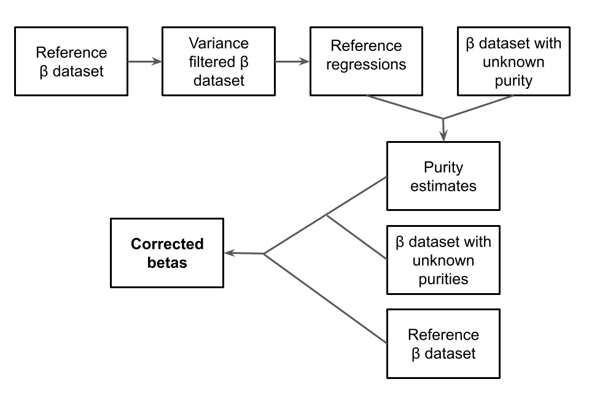

# Developing a tumor DNA methylation β value correction model through *in silico* sample purity estimation

* Author: Iñaki Sasiain Casado (inaki.sasiain_casado@med.lu.se)
* Supervisor: Johan Staaf
* Master's Programme in Bioinformatics, Lund University
* BINP39 (30 ECTS)

## WORKFLOW

This repository contains the code to correct β values of samples with unknown sample purities. The procedure presented here consist on three main steps; 

1. Generate reference regressions that reflect the different methylation states of ecah CpG based on the Staaf-Aine β correction estrategy.

2. Etimating purity of the samples from the β values using the refrence regressions generated on the previous step. 

3. Correct β values of the samples whose purty has been estimated using the Staaf-Aine approach. This last step can be carried out refitting the reference regressions to icnlude the new data-points whose purtity has been estimated, or using only the original reference regressions.



## SCRIPTS

* MAIN SCRIPTS

    * **new_purity_corrector.r**. This script is an adaptation of the Staaf-Aine β correction method, that apart from correcting betas based on the mentioned method, it outputs the refernce regressions' parameters to be used in the purity estimation.

    * **purity_estimator.r**. This script estimate sample purity based only on beta values and the regression parameters of a reference dataset generated by the previous script. 

    * **final_beta_correction.r**. This script correct methylation β values of samples whose purity has been estimated using the previous script based on the Staaf-Aine method. This script refits the refernce regressions using the new datapoints (β values + estimated purity).

    * **final_beta_correction_without_refitting.r**. This script correct methylation β values of samples whose purity has been estimated using the previous script based on the Staaf-Aine method. This script does not refit the refernce regressions using the new datapoints, it directly uses the refrence regressions from the refernce dataset to correct betas.

* DATA PROCESSING AND PLOTTING SCRIPTS

    * **get_most_variable_cpgs.r.**. This script outputs the CpGs with the most variable CpGs based on a beta value dataset. It can be used specifying a variance threshold or a certain CpG number.

    * **preprocessing_data.r**. This script reformats R objects containing beta valuesa and sample purities to generate files to be inputed to the main scripts.

    * **split_based_on_purity.r**. This script allows to split a beta value dataset based on their actual purity values.

    * **split_cross_validation.**. This script splits a refernce beta value and purity dataset to be used in a cross-validation approach to test the performance of the designed purity estimation algorithm.

    * **analyse_output.r**. This script produces plots from the output of the purity estimation algorithm to analyse the obtained result. The experimentally determined actual purity must be provided.

    * **compare_cross_validation.r**. This script compares the results of the different folds and checked parameters of the cross validation. It generates a plot showing the evolution of the estimation's performance.
    
    * **plot_ind_cpg.r**. This script plots the different populations identified per each CpG in the reference data. This plot was used to generate plots for the report's methods section.

    * **compare_CpGs.r**. This script compares the CpG context of the CpGs used for the purity prediction and the total CpGs to analyse their representativity.
 
    * **plot_coverage_overestimation.r**. This script generates coverage plots to analyse the overestimation of low purity values.

    * **heatmap_script.r**. This script produces a heatmap from the final beta corrected values (original value, corrected tumor and corrected microenvironment) to analyse the final output of the complete pipeline. 


## USAGE OF THE MAIN SCRIPTS

* new_purity_corrector.r
```bash
Rscript path_to_script/new_purity_corrector.r -c [NUM_OF_CORES] -b [INPUT_BETAS.RData] -p [INPUT_PURITIES.RData] -o [OUTPUT_PATH] -n [OUTPUT_NAME] -v [VARIANCE_THRESHOLD]
```

* purity_estimator.r
```bash
Rscript path_to_script/purity_estimator.r -c [NUM_OF_CORES] -a [ALPHA_VALUE] -s [SLOPE_THRESHOLD] -p [PERCENTAGE_TO_INTERVAL] -d [REGRESSIONS_DIRECTORY] -b [BETAS_TO_ANALYSE] -o [OUTPUT_NAME] -l [OUTPUT_LOCATION]
```

* final_beta_correction.r
```bash
```

* final_beta_correction_without_refitting.r
```bash
```

## EXPERIMENTAL PROCEDURE

### I. General performance analysis: Analysing the effect of the coverage correction in the 5000 most variable CpGs in BRCA

1. Splitting the data in training and test and generating RData file with the output

```bash
cd ~/Methylation/adjustBetas/01_5000_CpG/original_data; 

#Splitting dataset in training (80%) and test (20%)
Rscript ../../scripts/get_data_to_analyse/preprocessing_data.r -s TRUE -B ./workspace_tcgaBrca_top5000.RData -b betaUnadjusted -p purityVector -S TRUE -v 20; 
```

2. Calculate regression parameters from the training data

```bash
cd ~/Methylation/adjustBetas/01_5000_CpG/pop_regressions;

#Running the adapted Staaf-Aine correction to generate reference regressions
Rscript ../../scripts/calculate_regs/new_purity_corrector.r -c 7 -b ../original_data/betas_training.RData -p ../original_data/purity_training.RData;
```

3. Use the regression from the training data to estimate purities from validation data

```bash
cd ~/Methylation/adjustBetas/01_5000_CpG/output;

#Calculating the results with the coverage correction. The defult parameters were used (slope_threshold=0.3, alpha=0.7 and percentage_to_interval=4).
Rscript ../../scripts/calculate_purity/purity_estimator.r -c 7 -d ../pop_regressions -b ../original_data/betas_validation.RData -o corr_estimated_purity_5000CpG;

#Calulating the results without the correction method (The lines that correct the coverage were commented, 82 and 121-161 from purity_coverage.r). The default parameterss were used (slope_threshold=0.3, alpha=0.7 and percentage_to_interval=4).
Rscript ../../scripts/calculate_purity/purity_estimator.r -c 7 -d ../pop_regressions -b ../original_data/betas_validation.RData -o uncorr_estimated_purity_5000CpG;
```

4. Analyse output data to produce plots.

```bash
cd ~/Methylation/adjustBetas/01_5000_CpG/plots;

#Generating plots from the corrected data
Rscript ../../scripts/analyse_output/analyse_output.r -e ../output/corr_estimated_purity_5000CpG.RData -a ../original_data/purity_validation.RData -b ../original_data/betas_validation.RData -c ../output/corr_estimated_purity_5000CpG.used_cpgs.RData -o 5k_corr;

#Generating plots from the uncorrected data
Rscript ../../scripts/analyse_output/analyse_output.r -e ../output/uncorr_estimated_purity_5000CpG.RData -a ../original_data/purity_validation.RData -b ../original_data/betas_validation.RData -c ../output/uncorr_estimated_purity_5000CpG.used_cpgs.RData -o 5k_uncorr;
```

5. Analyse the signal overestimation in low sample purities;

```bash
# SPLITTING DATA

cd ~/Methylation/adjustBetas/01_5000_CpG/original_data/purity_splitted;

#Splitting the original validation dataset based on their actual purity values
Rscript ../../../scripts/get_data_to_analyse/split_based_on_purity.r;

# GENERATING DATA TO PLOT


#Predicting purity per for each purity group WITH CORRECTION. Line 235 was uncommented to get the desired coverage data. The default parameters were used.

cd ~/Methylation/adjustBetas/01_5000_CpG/plots/analyse_overestimation/data_to_plot/corrected;

for int in $(ls ../../../../original_data/purity_splitted/betas_*.RData); 
    do filename=$(echo ${int} | cut -d \/ -f 7 | sed 's/.RData//');
       echo ${filename};
       Rscript ../../../../../scripts/calculate_purity/purity_estimator.r -c 7 -d ../../../../pop_regressions -b ${int} -o ${filename}; 
    done;

#Predicting purity per for each purity group WITHOUT CORRECTION (The lines that correct the coverage were commented, 82 and 121-161 from purity_coverage.r). Line 235 was uncommented to get the desired coverage data. The default parameters were used.

cd ~/Methylation/adjustBetas/01_5000_CpG/plots/analyse_overestimation/data_to_plot/uncorrected;

for int in $(ls ../../../../original_data/purity_splitted/betas_*.RData); 
    do filename=$(echo ${int} | cut -d \/ -f 7 | sed 's/.RData//');
       echo ${filename};
       Rscript ../../../../../scripts/calculate_purity/purity_estimator.r -c 7 -d ../../../../pop_regressions -b ${int} -o ${filename}; 
    done;

# PLOTTING

cd ~/Methylation/adjustBetas/01_5000_CpG/plots/analyse_overestimation;

#Plotting corrected coverages
for my_file in $(ls ./data_to_plot/corrected/betas_from_*_to_*[0-9].RData);
    do plotname=$(echo ${my_file} | cut -d \/ -f 4 | sed 's/.RData//' | sed 's/betas_//' );
       echo ${plotname};
       Rscript ../../../scripts/analyse_output/plot_coverage_overestimation.r -i ${my_file} -t ${plotname} -o corrected_${plotname}
    done;

#Plotting uncorrected coverages
for my_file in $(ls ./data_to_plot/uncorrected/betas_from_*_to_*[0-9].RData);
    do plotname=$(echo ${my_file} | cut -d \/ -f 4 | sed 's/.RData//' | sed 's/betas_//' );
       echo ${plotname};
       Rscript ../../../scripts/analyse_output/plot_coverage_overestimation.r -i ${my_file} -t ${plotname} -o uncorrected_${plotname}
    done;
```


### II. Parameter optimization: 6-Fold cross-validation

* **VARIANCE THRESHOLD OPTIMIZATION**

1. Splitting BRCA, LUAC and LUSC data

```bash
cd /home/Illumina/Iñaki_Sasiain/08_Cross_validation/data/var_filtered;

# Splitting BRCA data
cd /home/Illumina/Iñaki_Sasiain/08_Cross_validation/data/var_filtered/BRCA;
       
Rscript ../../../../scripts/get_data_to_analyse/split_cross_validation.r -s FALSE -B ../../../../data/BRCA_data/data450k_421368x630_minfiNormalized_ringnerAdjusted_purityAdjusted_originalBetaValues.RData -P ../../../../data/BRCA_data/450k_CpGs_purities.RData -b betaOrig -u purityVector -S FALSE -C TRUE -k 6 -c chr -N FALSE;


# Splitting LUAD data (lines 125 and 126 have been commented)
cd /home/Illumina/Iñaki_Sasiain/08_Cross_validation/data/var_filtered/LUAD;
       
Rscript ../../../../scripts/get_data_to_analyse/split_cross_validation.r -s FALSE -B ../../../../data/LUAD_data/LUAD_data450k_421368x418_minfiNormalized_ringnerAdjusted_purityAdjusted_originalBetaValues.RData -P ../../../../data/LUAD_data/LUAD_LUSC_purity.RData -b betaOrig -u purity_LUAD -S FALSE -C TRUE -k 6 -c chr -N FALSE;


# Splitting LUSC data (lines 125 and 126 have been commented)
cd /home/Illumina/Iñaki_Sasiain/08_Cross_validation/data/var_filtered/LUSC;
       
Rscript ../../../../scripts/get_data_to_analyse/split_cross_validation.r -s FALSE -B ../../../../data/LUSC_data/LUSC_data450k_421368x333_minfiNormalized_ringnerAdjusted_purityAdjusted_originalBetaValues.RData -P ../../../../data/LUSC_data/LUAD_LUSC_purity.RData -b betaOrig -u purity_LUSC -S FALSE -C TRUE -k 6 -c chr -N FALSE;
```

2. Determining regressions per variance threshold and fold

```bash
cd /home/Illumina/Iñaki_Sasiain/08_Cross_validation/calculate_regressions/var_filtered;

#Defining cancer type list
type_ls=(BRCA LUAD LUSC);

for cancer_type in ${type_ls[@]};

    do mkdir /home/Illumina/Iñaki_Sasiain/08_Cross_validation/calculate_regressions/var_filtered/${cancer_type};
    cd /home/Illumina/Iñaki_Sasiain/08_Cross_validation/calculate_regressions/var_filtered/${cancer_type};

    #Defining var thresholds to analyse
    var_list=(0.03 0.035 0.04 0.045 0.05 0.055 0.06 0.065 0.07 0.075 0.08);

    # Calculating regression for each cancer type, variuance and fold
    for var in ${var_list[@]};
        do mkdir /home/Illumina/Iñaki_Sasiain/08_Cross_validation/calculate_regressions/var_filtered/${cancer_type}/var_${var}; 
        cd /home/Illumina/Iñaki_Sasiain/08_Cross_validation/calculate_regressions/var_filtered/${cancer_type};
        for dir in $(ls ../../../data/var_filtered/${cancer_type}/*_BetasTraining.RData);                           
            do fold=$(echo ${dir} | cut -d \/ -f 7 | cut -d _ -f 1);
            mkdir /home/Illumina/Iñaki_Sasiain/08_Cross_validation/calculate_regressions/var_filtered/${cancer_type}/var_${var}/${fold};
            cd /home/Illumina/Iñaki_Sasiain/08_Cross_validation/calculate_regressions/var_filtered/${cancer_type}/var_${var}/${fold};
            Rscript ../../../../../../scripts/calculate_regs/new_purity_corrector.r -c 37 -b /home/Illumina/Iñaki_Sasiain/08_Cross_validation/data/var_filtered/${cancer_type}/${fold}_BetasTraining.RData -p /home/Illumina/Iñaki_Sasiain/08_Cross_validation/data/var_filtered/${cancer_type}/${fold}_PurityTraining.RData -o ${cancer_type}_${var}_${fold} -v ${var};
        done;
    done;
done;
```

3. Estimating purity

```bash
cd /home/Illumina/Iñaki_Sasiain/08_Cross_validation/estimate_purity/var_filtered;

#Defining cancer type list
type_ls=(BRCA LUAD LUSC);

for cancer_type in ${type_ls[@]};
   do mkdir /home/Illumina/Iñaki_Sasiain/08_Cross_validation/estimate_purity/var_filtered/${cancer_type};

      #Defining var cpg number list 
    var_list=(0.03 0.035 0.04 0.045 0.05 0.055 0.06 0.065 0.07 0.075 0.08);

      #Determining purity for each cpg number and fold
      for var in ${var_list[@]}; 
        do cd /home/Illumina/Iñaki_Sasiain/08_Cross_validation/estimate_purity/var_filtered/${cancer_type};
           mkdir /home/Illumina/Iñaki_Sasiain/08_Cross_validation/estimate_purity/var_filtered/${cancer_type}/var_${var};
           for dir in $(ls ../../../data/var_filtered/${cancer_type}/*_BetasTraining.RData);                           
                  do fold=$(echo ${dir} | cut -d \/ -f 7 | cut -d _ -f 1);
                  mkdir /home/Illumina/Iñaki_Sasiain/08_Cross_validation/estimate_purity/var_filtered/${cancer_type}/var_${var}/${fold};
                  cd /home/Illumina/Iñaki_Sasiain/08_Cross_validation/estimate_purity/var_filtered/${cancer_type}/var_${var}/${fold};
                  Rscript ../../../../../../scripts/calculate_purity/run_all_validation.r -c 40 -d ../../../../../calculate_regressions/var_filtered/${cancer_type}/var_${var}/${fold} -b ../../../../../data/var_filtered/${cancer_type}/${fold}_BetasTest.RData  -o PredPurity_${cancer_type}_${fold}_var${var} -a 0.75 -s 0.25 -p 5;
        done;
    done;
done;
```

4. Comparing results

```bash
cd /home/Illumina/Iñaki_Sasiain/08_Cross_validation/analyse_output;

#Defining variables to run the script
list_of_folds=$(find ../estimate_purity/cpgs_100 -mindepth 1 -maxdepth 1 -type d | cut -d \/ -f 4 | tr "\n" "," | sed 's/,$//');
list_of_var=$(find ../estimate_purity/var_filtered/BRCA/var* -maxdepth 0 | cut -d \/ -f 5 | tr "\n
" "," | sed 's/,$//');
estimated_purities="../estimate_purity/var_filtered/LUAC,../estimate_purity/var_filtered/LUSC,../estimate_purity/var_filtered/BRCA";
actual_purities="../../10_LUAC_final/data/full_data/purity.RData,../../11_LUSC_final/data/full_data/purity.RData,../../data/BRCA_data/BRCA_purities.RData";

#Plotting the results
Rscript /home/Illumina/Iñaki_Sasiain/scripts/analyse_output/compare_cross_validation.r -f ${list_of_folds} -c ${list_of_var} -m TRUE -d ${estimated_purities} -p ${actual_purities} -o cpg_var_BRCA_LUAC_LUSC; 
```

* **SLOPE THRESHOLD OPTIMIZATION**

1. Splitting BRCA data in folds, and generating training and test sets

```bash
cd /home/Illumina/Iñaki_Sasiain/08_Cross_validation/data/slope_filtered;

#Lines 124 and 125 of split_cross_validation.r were uncommented to adapt sample name. 
Rscript ../../../scripts/get_data_to_analyse/split_cross_validation.r -s FALSE -B ../../../data/BRCA_data/data450k_421368x630_minfiNormalized_ringnerAdjusted_purityAdjusted_originalBetaValues.RData -P ../../../data/BRCA_data/450k_CpGs_purities.RData -b betaOrig -u purityVector -S FALSE -C TRUE -k 6 -c chr -N TRUE -n 30000;
```

2. Determining regressions per each fold

```bash
cd /home/Illumina/Iñaki_Sasiain/08_Cross_validation/calculate_regressions/slope_filtered;

#Determining reference regressions per each
for dir in $(ls ../../data/slope_filtered/*_BetasTraining.RData);                           
    do fold=$(echo ${dir} | cut -d \/ -f 5 | cut -d _ -f 1);
        echo ${fold};
        mkdir /home/Illumina/Iñaki_Sasiain/08_Cross_validation/calculate_regressions/slope_filtered/${fold};
        cd /home/Illumina/Iñaki_Sasiain/08_Cross_validation/calculate_regressions/slope_filtered/${fold};
        Rscript ../../../../scripts/calculate_regs/new_purity_corrector.r -c 37 -b /home/Illumina/Iñaki_Sasiain/08_Cross_validation/data/slope_filtered/${fold}_BetasTraining.RData -p /home/Illumina/Iñaki_Sasiain/08_Cross_validation/data/slope_filtered/${fold}_PurityTraining.RData -o ${fold} -v 0
    done;
```

3. Estimating purity

```bash
cd /home/Illumina/Iñaki_Sasiain/08_Cross_validation/estimate_purity;

#Running the scripts using nohup
#Defining slope threshold list 
slopes=(0.01 0.05 0.1 0.15 0.2 0.25 0.3 0.35 0.4 0.45 0.5 0.55 0.6 0.65 0.7 0.75 0.8)
#Determining purity for each slope threshold and fold
for num in ${slopes[@]}; 
    do cd /home/Illumina/Iñaki_Sasiain/08_Cross_validation/estimate_purity;
       mkdir /home/Illumina/Iñaki_Sasiain/08_Cross_validation/estimate_purity/slope_${num};
       for dir in $(ls ../data/slope_filtered/*_BetasTraining.RData);
          do fold=$(echo ${dir} | cut -d \/ -f 4 | cut -d _ -f 1);
             mkdir /home/Illumina/Iñaki_Sasiain/08_Cross_validation/estimate_purity/slope_${num}/${fold};
             cd /home/Illumina/Iñaki_Sasiain/08_Cross_validation/estimate_purity/slope_${num}/${fold};
             Rscript ../../../../scripts/calculate_purity/purity_estimator.r -c 40 -d ../../../calculate_regressions/slope_filtered/${fold} -b ../../../data/slope_filtered/${fold}_BetasTest.RData -o PredPurity_${fold}_slope${num} -a 0.75 -s ${num} -p 5;
    done;
done;
```

4. Comparing results

```bash
cd /home/Illumina/Iñaki_Sasiain/08_Cross_validation/analyse_output;

#Defining lists of folds and slope thresholds to plot the results
list_of_folds=$(find ../estimate_purity/slope_0.01 -mindepth 1 -maxdepth 1 -type d | cut -d \/ -f 4 | tr "\n" "," | sed 's/,$//');
list_of_slopes=$(find ../estimate_purity/slope* -maxdepth 0 | cut -d \/ -f 3 | tr "\n" "," | sed 's/,$//');

#Defining the directory path were the estimated purities are storted
path="/home/Illumina/Iñaki_Sasiain/08_Cross_validation/estimate_purity";

#Plotting the results
Rscript /home/Illumina/Iñaki_Sasiain/scripts/analyse_output/compare_cross_validation.r -f ${list_of_folds} -c ${list_of_slopes} -d ${path} -p /home/Illumina/Iñaki_Sasiain/data/BRCA_data/BRCA_purities.RData -o slope_CrossVal; 
```

* **ALPHA VALUE OPTIMIZATION**

1. Getting BRCA data

```bash
cd /home/Illumina/Iñaki_Sasiain/08_Cross_validation/data/alpha;

#Lines 124 and 125 of split_cross_validation.r were commented to adapt sample name. 
Rscript ../../../scripts/get_data_to_analyse/split_cross_validation.r -s FALSE -B ../../../data/BRCA_data/data450k_421368x630_minfiNormalized_ringnerAdjusted_purityAdjusted_originalBetaValues.RData -P ../../../data/BRCA_data/450k_CpGs_purities.RData -b betaOrig -u purityVector -S FALSE -C TRUE -k 6 -c chr -N TRUE -n 30000;
```

2. Determining regressions per each fold

```bash
cd /home/Illumina/Iñaki_Sasiain/08_Cross_validation/calculate_regressions/alpha;

#Determining reference regressions per each
for dir in $(ls ../../data/alpha/*_BetasTraining.RData);                           
    do fold=$(echo ${dir} | cut -d \/ -f 5 | cut -d _ -f 1);
        echo ${fold};
        mkdir /home/Illumina/Iñaki_Sasiain/08_Cross_validation/calculate_regressions/alpha/${fold};
        cd /home/Illumina/Iñaki_Sasiain/08_Cross_validation/calculate_regressions/alpha/${fold};
        Rscript ../../../../scripts/calculate_regs/new_purity_corrector.r -c 40 -b /home/Illumina/Iñaki_Sasiain/08_Cross_validation/data/alpha/${fold}_BetasTraining.RData -p /home/Illumina/Iñaki_Sasiain/08_Cross_validation/data/alpha/${fold}_PurityTraining.RData -o ${fold} -v 0
    done;
```

3. Calculating purity  per alpha value

```bash
cd /home/Illumina/Iñaki_Sasiain/08_Cross_validation/estimate_purity;


#Defining alpha list 
alphas=(0.1 0.15 0.2 0.25 0.3 0.35 0.4 0.45 0.5 0.55 0.6 0.65 0.7 0.75 0.8 0.85 0.9 0.95);
#Determining purity for each alpha and fold
for num in ${alphas[@]}; 
    do cd /home/Illumina/Iñaki_Sasiain/08_Cross_validation/estimate_purity;
       mkdir /home/Illumina/Iñaki_Sasiain/08_Cross_validation/estimate_purity/alpha_${num};
       for dir in $(ls ../data/alpha/*_BetasTraining.RData); #Using 30000 cpgs in the prediction
          do fold=$(echo ${dir} | cut -d \/ -f 4 | cut -d _ -f 1);
             mkdir /home/Illumina/Iñaki_Sasiain/08_Cross_validation/estimate_purity/alpha_${num}/${fold};
             cd /home/Illumina/Iñaki_Sasiain/08_Cross_validation/estimate_purity/alpha_${num}/${fold};
            Rscript ../../../../scripts/calculate_purity/purity_estimator.r -c 40 -d ../../../calculate_regressions/alpha/${fold} -b ../../../data/alpha/${fold}_BetasTest.RData -o PredPurity_${fold}_slope${num} -a ${num} -s 0.25 -p 5;
    done;
done;
```

4. Comparing results

```bash
# Define variables required to run the script
cd /home/Illumina/Iñaki_Sasiain/08_Cross_validation/analyse_output;
list_of_folds=$(find ../estimate_purity/cpgs_100 -mindepth 1 -maxdepth 1 -type d | cut -d \/ -f 4 | tr "\n" "," | sed 's/,$//');
list_of_alphas=$(find ../estimate_purity/alpha* -maxdepth 0 | cut -d \/ -f 3 | tr "\n" "," | sed 's/,$//');

path="/home/Illumina/Iñaki_Sasiain/08_Cross_validation/estimate_purity";

#Plotting the results
Rscript /home/Illumina/Iñaki_Sasiain/scripts/analyse_output/compare_cross_validation.r -f ${list_of_folds} -c ${list_of_alphas} -d ${path} -p /home/Illumina/Iñaki_Sasiain/data/BRCA_data/BRCA_purities.RData -o alpha_CrossVal;
```


### III. Checking pan-cancer applicability; BRCA, LUAC and LUSC 

1. Generating Training (80%) and test (20%) subsets

```bash
# Genereating training (80%) and test (20%) subsets for BRCA data
cd /home/Illumina/Iñaki_Sasiain/09_BRCA_final/data/training_test;

Rscript ../../../scripts/get_data_to_analyse/preprocessing_data.r -s FALSE -B ../../../data/BRCA_data/data450k_421368x630_minfiNormalized_ringnerAdjusted_purityAdjusted_originalBetaValues.RData -P ../../../data/BRCA_data/450k_CpGs_purities.RData -b betaOrig -p purityVector -f FALSE -N FALSE -S TRUE -v 20;

# Genereating training (80%) and test (20%) subsets for LUAC data
cd /home/Illumina/Iñaki_Sasiain/10_LUAC_final/data/training_test;

Rscript ../../../scripts/get_data_to_analyse/preprocessing_data.r -s FALSE -B ../../../data/LUAD_data/LUAD_data450k_421368x418_minfiNormalized_ringnerAdjusted_purityAdjusted_originalBetaValues.RData -P /home/Illumina/Iñaki_Sasiain/data/LUAD_data/LUAD_LUSC_purity.RData -b betaOrig -p purity_LUAD -f FALSE -N FALSE -S TRUE -v 20;

# Genereating training (80%) and test (20%) subsets for LUSC data
cd /home/Illumina/Iñaki_Sasiain/11_LUSC_final/data/training_test;

Rscript ../../../scripts/get_data_to_analyse/preprocessing_data.r -s FALSE -B /home/Illumina/Iñaki_Sasiain/data/LUSC_data/LUSC_data450k_421368x333_minfiNormalized_ringnerAdjusted_purityAdjusted_originalBetaValues.RData -P /home/Illumina/Iñaki_Sasiain/data/LUSC_data/LUAD_LUSC_purity.RData -b betaOrig -p purity_LUSC -f FALSE -N FALSE -S TRUE -v 20;
```

2. Determining reference regressions from trainig subsets

```bash
# Generating regressions for BRCA. Using 0.05 as the variance threshold
cd /home/Illumina/Iñaki_Sasiain/09_BRCA_final/regressions/training_test;

Rscript ../../../scripts/calculate_regs/new_purity_corrector.r -c 40 -b ../../data/training_test/betas_training.RData -p ../../data/training_test/purity_training.RData -o LUAC_regs_Training. -v 0.05;

# Generating regressions for LUAC. Using 0.05 as the variance threshold
cd /home/Illumina/Iñaki_Sasiain/10_LUAC_final/regressions/training_test;

Rscript ../../../scripts/calculate_regs/new_purity_corrector.r -c 40 -b ../../data/training_test/betas_training.RData -p ../../data/training_test/purity_training.RData -o LUAC_regs_Training. -v 0.05;

# Generating regressions for LUSC. Using 0.05 as the variance threshold
cd /home/Illumina/Iñaki_Sasiain/11_LUSC_final/regressions/training_test;

Rscript ../../../scripts/calculate_regs/new_purity_corrector.r -c 40 -b ../../data/training_test/betas_training.RData -p ../../data/training_test/purity_training.RData -o LUSC_regs_Training. -v 0.05;
```

3. Calculating purity

```bash
# Estimating purities for BRCA using alpha=0.7 and slope_threshold=0.25
cd /home/Illumina/Iñaki_Sasiain/09_BRCA_final/estimate_purity;

Rscript ../../scripts/calculate_purity/purity_estimator.r -c 40 -d ../regressions/training_test/ -b ../data/training_test/betas_validation.RData -o BRCA_training_test -a 0.70 -s 0.25 -p 5;


# Estimating purities for LUAC using alpha=0.7 and slope_threshold=0.25
cd /home/Illumina/Iñaki_Sasiain/10_LUAC_final/estimate_purity;

Rscript ../../scripts/calculate_purity/purity_estimator.r -c 40 -d ../regressions/training_test/ -b ../data/training_test/betas_validation.RData -o LUAC_training_test -a 0.7 -s 0.25 -p 5;


# Estimating purities for LUSC using alpha=0.7 and slope_threshold=0.25
cd /home/Illumina/Iñaki_Sasiain/11_LUSC_final/estimate_purity;

Rscript ../../scripts/calculate_purity/purity_estimator.r -c 40 -d ../regressions/training_test -b ../data/training_test/betas_validation.RData -o LUSC_training_test -a 0.75 -s 0.25 -p 5;
```

4. Analysing output

```bash
# Generating plots for BRCA (UNCOMMENT LINE 158 TO ADAPT SAMPLE NAMES)
cd /home/Illumina/Iñaki_Sasiain/09_BRCA_final/plots;

Rscript ../../scripts/analyse_output/analyse_output.r -e ../estimate_purity/BRCA_training_test.RData -a ../data/training_test/purity_validation.RData -c ../estimate_purity/BRCA_training_test.used_cpgs.RData -o BRCA_training_test_plots -b ../data/training_test/betas_validation.RData -P TRUE -p ../data/ploidy/BRCA_ploidy.RData;

# Generating plots for LUAC
cd /home/Illumina/Iñaki_Sasiain/10_LUAC_final/plots;

Rscript ../../scripts/analyse_output/analyse_output.r -e ../estimate_purity/LUAC_training_test.RData -a ../data/training_test/purity_validation.RData -c ../estimate_purity/LUAC_training_test.used_cpgs.RData -o LUAC_training_test_plots -b ../data/training_test/betas_validation.RData -P TRUE -p ../data/ploidy/LUAD_ploidy.RData;

# Generating plots for LUSC
cd /home/Illumina/Iñaki_Sasiain/11_LUSC_final/plots;

Rscript ../../scripts/analyse_output/analyse_output.r -e ../estimate_purity/LUSC_training_test.RData -a ../data/training_test/purity_validation.RData -c ../estimate_purity/LUSC_training_test.used_cpgs.RData -o LUSC_training_test_plots -b ../data/training_test/betas_validation.RData -P TRUE -p ../data/ploidy/LUSC_ploidy.RData;
```

* ANALYSING REPRESENTATIVITY OF CPGS USED

```bash
#Getting reference betas
cd /home/Illumina/Iñaki_Sasiain/13_CpG_analysis/data/cohorts; 

cp /home/Illumina/Iñaki_Sasiain/09_TNBC_final/data/training/betas.RData breast_ref.RData;
cp /home/Illumina/Iñaki_Sasiain/10_LUAC_final/data/full_data/betas.RData LUAC_ref.RData;
cp /home/Illumina/Iñaki_Sasiain/11_LUSC_final/data/full_data/betas.RData LUSC_ref.RData;


cd /home/Illumina/Iñaki_Sasiain/13_CpG_analysis/data;

#Getting Cpg list for breast cancer
Rscript ../../scripts/get_data_to_analyse/get_most_variables_cpgs.r -r ./cohorts/BRCA_ref.RData -a ./cohorts/BRCA_ref.RData -l TRUE -V TRUE -v 0.05 -p BRCA_var0.05;

#Getting CpG list for LUAC
Rscript ../../scripts/get_data_to_analyse/get_most_variables_cpgs.r -r ./cohorts/LUAC_ref.RData -a ./cohorts/LUAC_ref.RData -l TRUE -V TRUE -v 0.05 -p LUAD_var0.05;

#Getting CpG list for LUSC
Rscript ../../scripts/get_data_to_analyse/get_most_variables_cpgs.r -r ./cohorts/LUSC_ref.RData -a ./cohorts/LUSC_ref.RData -l TRUE -V TRUE -v 0.05 -p LUSC_var0.05;
```

```R
#Integrating annotation of BRCA LUAC and LUSC in a single file


#Storing data as variables
load("BRCA_CpG_annotation.RData")
anno_BRCA <- annoObj

anno_LUAD <- read.csv("EPIC_760405CpGs_contexts.csv", row.names=1)

anno_LUSC <- read.csv("LUSC_CpGs_per_context.csv", row.names=1)


#Merging data into a single dataframe
merged_annotation <- anno_LUAD[,c("promoter","proximal","distal","cgi","shore","ocean","atacLUAD")]
merged_annotation[,"atacLUSC"] <- anno_LUSC[rownames(merged_annotation),"atacLUSC"]
merged_annotation[,"atacBRCA"] <- anno_BRCA[rownames(merged_annotation), "hasAtacOverlap"]

merged_annotation[,"nonAtacLUAD"] <- abs(1-merged_annotation[,"atacLUAD"])
merged_annotation[,"nonAtacLUSC"] <- abs(1-merged_annotation[,"atacLUSC"])
merged_annotation[,"nonAtacBRCA"] <- abs(1-merged_annotation[,"atacBRCA"])

#Saving merged df
saveRDS(merged_annotation, file="annotation_file.RData")

#Analysing the data
```

```bash
cd /home/Illumina/Iñaki_Sasiain/13_CpG_analysis/plots;

cpg_list=$(find "${PWD%/*}" -name '*_var0.05_CpG_vector.RData' | tr "\n" ",");

nohup Rscript ../../scripts/analyse_output/compare_CpGs.r -c ${cpg_list} -a ../data/annotation_file.RData -p BRCA_LUAC_LUSC;
```

### IV. Computing refernce regressions

1. Getting refernce raw data

```bash
# Getting refernce raw data: BRCA
cd /home/Illumina/Iñaki_Sasiain/reference/BRCA_raw;

Rscript ../../scripts/get_data_to_analyse/preprocessing_data.r -s FALSE -B ../../data/BRCA_data/data450k_421368x630_minfiNormalized_ringnerAdjusted_purityAdjusted_originalBetaValues.RData -P ../../data/BRCA_data/450k_CpGs_purities.RData -b betaOrig -p purityVector -f FALSE -N FALSE -S FALSE;

# Getting refernce raw data: LUAD
cd /home/Illumina/Iñaki_Sasiain/reference/LUAD_raw;

Rscript ../../scripts/get_data_to_analyse/preprocessing_data.r -s FALSE -B ../../data/LUAD_data/LUAD_data450k_421368x418_minfiNormalized_ringnerAdjusted_purityAdjusted_originalBetaValues.RData -P ../../data/LUAD_data/LUAD_LUSC_purity.RData -b betaOrig -p purity_LUAD -f FALSE -N FALSE -S FALSE;

# Getting refernce raw data: LUSC
cd /home/Illumina/Iñaki_Sasiain/reference/LUSC_raw;

Rscript ../../scripts/get_data_to_analyse/preprocessing_data.r -s FALSE -B ../../data/LUSC_data/LUSC_data450k_421368x333_minfiNormalized_ringnerAdjusted_purityAdjusted_originalBetaValues.RData -P ../../data/LUSC_data/LUAD_LUSC_purity.RData -b betaOrig -p purity_LUSC -f FALSE -N FALSE -S FALSE;
```

2. Determining refrence regressions

```bash
# DETERMINING REFERNENCE REGRESSIONS: BRCA
cd /home/Illumina/Iñaki_Sasiain/reference/BRCA_regs;

# Getting regressions when var threshold = 0.05
cd /home/Illumina/Iñaki_Sasiain/reference/BRCA_regs/var_0.05;

Rscript ../../../scripts/calculate_regs/new_purity_corrector.r -c 40 -b ../../BRCA_raw/betas.RData -p ../../BRCA_raw/purity.RData -o BRCA_var0.05. -v 0.05;

# Getting regressions when var threshold = 0
cd /home/Illumina/Iñaki_Sasiain/reference/BRCA_regs/var_0;

Rscript ../../../scripts/calculate_regs/new_purity_corrector.r -c 40 -b ../../BRCA_raw/betas.RData -p ../../BRCA_raw/purity.RData -o BRCA_var0. -v 0;


# DETERMINING REFERNENCE REGRESSIONS: LUAD
cd /home/Illumina/Iñaki_Sasiain/reference/LUAD_regs;

# Getting regressions when var threshold = 0.05
cd /home/Illumina/Iñaki_Sasiain/reference/LUAD_regs/var_0.05;

Rscript ../../../scripts/calculate_regs/new_purity_corrector.r -c 40 -b ../../LUAD_raw/betas.RData -p ../../LUAD_raw/purity.RData -o LUAD_var0.05. -v 0.05;

# Getting regressions when var threshold = 0
cd /home/Illumina/Iñaki_Sasiain/reference/LUAD_regs/var_0;

Rscript ../../../scripts/calculate_regs/new_purity_corrector.r -c 40 -b ../../LUAD_raw/betas.RData -p ../../LUAD_raw/purity.RData -o LUAD_var0. -v 0;


# DETERMINING REFERNENCE REGRESSIONS: LUSC
cd /home/Illumina/Iñaki_Sasiain/reference/LUAD_regs;

# Getting regressions when var threshold = 0.05
cd /home/Illumina/Iñaki_Sasiain/reference/LUSC_regs/var_0.05;

Rscript ../../../scripts/calculate_regs/new_purity_corrector.r -c 40 -b ../../LUSC_raw/betas.RData -p ../../LUSC_raw/purity.RData -o LUSC_var0.05. -v 0.05;

# Getting regressions when var threshold = 0
cd /home/Illumina/Iñaki_Sasiain/reference/LUSC_regs/var_0;

Rscript ../../../scripts/calculate_regs/new_purity_corrector.r -c 40 -b ../../LUSC_raw/betas.RData -p ../../LUSC_raw/purity.RData -o LUSC_var0. -v 0;
```

### V. Running the whole pipeline: BRCA1 CpGs in TNBC

* USING THE WHOLE BRCA-TCGA TO CREATE REGRESSIONS USED TO CORRECT BETAS

1. Getting reference data

```bash
#Getting precomputed variance filtered regressions for the purity estimation
cd /home/Illumina/Iñaki_Sasiain/14_example_BRCA1/reference_data/ref_regressions;
cp ../../../reference/BRCA_regs/var_0.05/* .;

#Getting precomputed non-variance filtered regressions for the beta correction
cd /home/Illumina/Iñaki_Sasiain/14_example_BRCA1/reference_data/ref_regressions/all_the_cpgs;
cp ../../../../reference/BRCA_regs/var_0/* .;

#Getting reference betas and purities
cd /home/Illumina/Iñaki_Sasiain/14_example_BRCA1/reference_data/ref_betas_and_purities;
cp ../../../reference/BRCA_raw/* .;
```

2. Getting data to analyse

```bash
cd /home/Illumina/Iñaki_Sasiain/14_example_BRCA1/data_to_correct;
#Getting and reformatting betas from GEO:

# Getting and unzipping the data
wget https://ftp.ncbi.nlm.nih.gov/geo/series/GSE148nnn/GSE148748/matrix/GSE148748_series_matrix.txt.gz;
gunzip GSE148748/matrix/GSE148748_series_matrix.txt.gz;


# Getting only rows of interest
cat GSE148748_series_matrix.txt | sed -n '27p; 58,$p' | sed 's/Breast cancer //g' > GSE148748_filtered_betas.txt;

# Preprocessing the downloaded file in R
```R
# Converting the tsv in a R object and removing headers.
GSE148748 <- read.csv("GSE148748_filtered_betas.txt", sep="\t", na.strings=c("", NA), head=1)

# Setting the sample and cpg ids as colnames and rownames
rownames(GSE148748) <- GSE148748$"X.Sample_title"
GSE148748 <- GSE148748[,-which(names(GSE148748)=="X.Sample_title")]

# Removing cpgs without beta values
GSE148748 <- GSE148748[-which(rowSums(is.na(GSE148748))==ncol(GSE148748)),]

#Saving the dataframe as an R object
saveRDS(GSE148748, file="GSE148748_betas.RData")
```

```R
#Producing and saving a R vector with the CpGs to correct
BRCA_cpgs <- read.table("promoterData_BRCA1.txt")[-1,7];
saveRDS(BRCA_cpgs, file="BRCA_cpgs.RData");
```

3. Estimate purity for the GSE data

```bash
cd /home/Illumina/Iñaki_Sasiain/14_example_BRCA1/purity_estimation;

# Estimating purity
Rscript ../../scripts/calculate_purity/purity_estimator.r -d ../reference_data/ref_regressions -b ../data_to_correct/GSE148748_betas.RData -c 40 -a 0.7 -s 0.25 -p 5;
```

3. Running beta correction 

```bash
cd /home/Illumina/Iñaki_Sasiain/14_example_BRCA1/corrected_betas;

#Running beta correction refitting the regressions
Rscript ../../scripts/final_beta_correction/final_beta_correction.r -c 1 -P ../reference_data/ref_betas_and_purities/purity.RData -B ../reference_data/ref_betas_and_purities/betas.RData -p ../purity_estimation/GSE148748_est_pur.tsv -b ../data_to_correct/GSE148748_betas.RData -F TRUE -f ../data_to_correct/BRCA_cpgs.RData -n ;


#Running beta correction without refittig refernce regressions
Rscript ../../scripts/final_beta_correction/final_beta_correction_without_refitting.r -R ../reference_data/ref_regressions/all_the_cpgs -p ../purity_estimation/GSE148748_est_pur.tsv -b ../data_to_correct/GSE148748_betas.RData -F TRUE -f ../data_to_correct/BRCA_cpgs.RData -n TNBC_without_refitting;
```

4. Analysisng results

```bash
cd /home/Illumina/Iñaki_Sasiain/14_example_BRCA1/plots;


#Plotting results when the regressions are refitted
Rscript ../../scripts/analyse_final_beta_correction/heatmap_script.r -o ../corrected_betas/TNBC_refitting_betas.original.samples_to_correct.RData -c ../corrected_betas/TNBC_refitting_betas.tumor.samples_to_correct.RData -m ../corrected_betas/TNBC_refitting_betas.microenvironment.samples_to_correct.RData -a ../data_to_correct/brcaStatus_BRCA1.txt -p refitting_heatmap;

#Plotting results when the regressions are NOT refitted
Rscript ../../scripts/analyse_final_beta_correction/heatmap_script.r -o ../corrected_betas/TNBC_without_refitting.original.samples_to_correct.RData -c ../corrected_betas/TNBC_without_refitting.tumor.samples_to_correct.RData -m ../corrected_betas/TNBC_without_refitting.microenvironment.samples_to_correct.RData -a ../data_to_correct/brcaStatus_BRCA1.txt -p without_refitting_heatmap;
```

* USING ONLY THE TNBC BRCA-TCGA DATA TO CREATE REGRESSIONS USED TO CORRECT BETAS

1. Copying data used in the last approach. Everything is kept equal except for the refernce data used for the correction
```bash
cd /home/Illumina/Iñaki_Sasiain/15_example_BRCA1_from_TNBC;
cp -r ../14_example_BRCA1/purity_estimation .;
cp -r ../14_example_BRCA1/data_to_correct/ref_betas_and_purities .;
cp ../data/TNBC_from_TCGA_annotation.RData ./ref_betas_and_purities/;
```

2. Filtering refernce data to correct. Keep only samples from TNBC

```bash
#Getting reference dataset
cd /home/Illumina/Iñaki_Sasiain/15_example_BRCA1_from_TNBC/ref_betas_and_purities;
cp ../../14_example_BRCA1/reference_data/ref_betas_and_purities/* .;
```

```R
#Getting the data
betas <- readRDS("betas.RData")
purities <- readRDS("purity.RData")
load("TNBC_from_TCGA_annotation.RData")

#Generating purity vector
sample_id <- sapply(rownames(annotations), 
                         function (name) {strsplit(name, "-01")[[1]][1]})
purities <- purities[sample_id]


#Generating beta dataframe
betas <- betas[,rownames(annotations)]
colnames(betas) <- sapply(colnames(betas), 
                         function (name) {strsplit(name, "-01")[[1]][1]})

saveRDS(betas, file="betas.RData")
saveRDS(purities, file="purity.RData")
```

3. Generating reference regressions only from the TNBC-TCGA data to be used in the beta correction without refitting

```bash
cd /home/Illumina/Iñaki_Sasiain/15_example_BRCA1_from_TNBC/ref_regressions;
Rscript ../../scripts/calculate_regs/new_purity_corrector.r -c 40 -b ../ref_betas_and_purities/betas.RData -p ../ref_betas_and_purities/purity.RData -o betas_from_TNBC;

```

4. Running beta correction 

```bash
cd /home/Illumina/Iñaki_Sasiain/15_example_BRCA1_from_TNBC/corrected_betas;

#Refitting the regressions
Rscript ../../scripts/final_beta_correction/final_beta_correction.r -c 1 -P ../ref_betas_and_purities/purity.RData -B ../ref_betas_and_purities/betas.RData -p ../purity_estimation/GSE148748_est_pur.tsv -b ../data_to_correct/GSE148748_betas.RData -F TRUE -f ../data_to_correct/BRCA_cpgs.RData -n TNBC_refitting;


#Without refitting the regressions
Rscript ../../scripts/final_beta_correction/final_beta_correction_without_refitting.r -R ../ref_regressions -p ../purity_estimation/GSE148748_est_pur.tsv -b ../data_to_correct/GSE148748_betas.RData -F TRUE -f ../data_to_correct/BRCA_cpgs.RData -n TNBC_without_refitting;
```

4. Plotting results

```bash
cd ../plots;

#Plotting results when the regressions are refitted
Rscript ../../scripts/analyse_final_beta_correction/heatmap_script.r -o ../corrected_betas/TNBC_from_TCGA_example_betas.original.samples_to_correct.RData -c ../corrected_betas/TNBC_from_TCGA_example_betas.tumor.samples_to_correct.RData -m ../corrected_betas/TNBC_from_TCGA_example_betas.microenvironment.samples_to_correct.RData -a ../data_to_correct/brcaStatus_BRCA1.txt -p refitting_heatmap;

#Plotting results when the regressions are NOT refitted
Rscript ../../scripts/analyse_final_beta_correction/heatmap_script.r -o ../corrected_betas/TNBC_from_TCGA_example_without_refitting.original.samples_to_correct.RData -c ../corrected_betas/TNBC_from_TCGA_example_without_refitting.tumor.samples_to_correct.RData -m ../corrected_betas/TNBC_from_TCGA_example_without_refitting.microenvironment.samples_to_correct.RData -a ../data_to_correct/brcaStatus_BRCA1.txt -p without_refitting_heatmap;
```